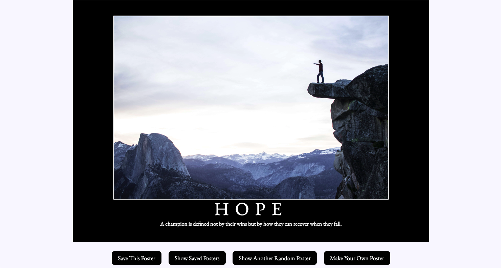
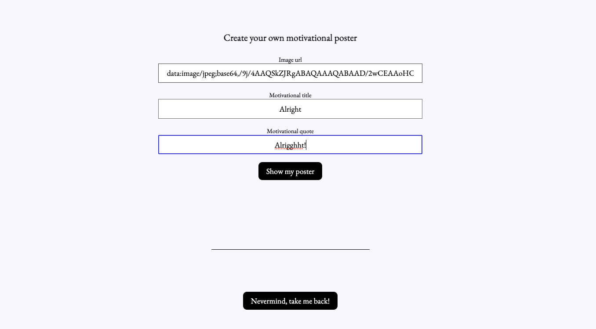
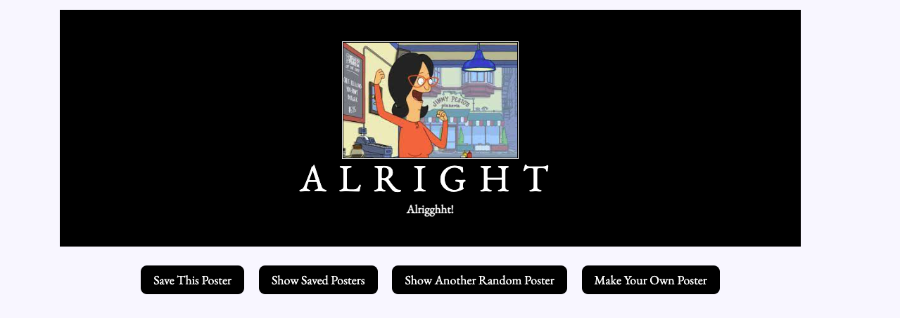

# [Hang In There](https://scottdgaines.github.io/poster-flipper/)

Mod 1, Project 2 (Paired)

## Overview

We all need a little pick-me-up every now and then. Now you can generate an inspirational poster, or create one of your own!

This app was built by Derek Cooper and Scott Gaines from a previously-set comp and data model provided by the Turing School of Software and Design. It's architecture includes:

* index.html
* styles.css
* an src directory containing:
  * main.js
  * poster.js
* an assets folder containing all poster images

## Installation Steps

1. Fork and clone this repo to your local machine.
2. Run 'cd tic-tac-toe' to move into the root directory.
3. Run 'open index.html' to open the application in your browser.

## Using the App

1. An inspirational poster will be displayed upon page load.
2. Generate a new, randomized poster by clicking the "Show Another Random Poster" button.
3. To create your own custom poster, click the "Make Your Own Poster" button:
  * Enter the URl for the desired image,
  * Enter your title,
  * Enter your quote,
  * Click the "Show my poster" button to display it, or the "Nevermind, take me back!" button to discard changes and return to the homepage.
4. To save your poster, click the "Save This Poster" button, and to view your previously-saved posters, click the "Show Saved Posters" button.
 * To delete any saved poster, double click on it's thumbnail on the "Saved Posters" page.
 
 ## Developer Contacts

Derek Cooper
+ Slack: @Derek Cooper
+ LinkedIn: www.linkedin.com/in/derek-cooper-a8798323a/

Scott Gaines
+ scottdgaines@gmail.com
+ Slack: @Scott Gaines
+ LinkedIn: www.linkedin.com/in/scottdgainesfe
+ GitHub: https://github.com/scottdgaines
 
